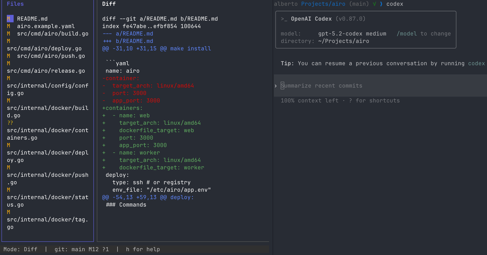

# wing

Watch your git diffs live in your terminal while keeping Codex/Claude on the right side.



> ⚠️ This project is a proof of concept.

---

## ✨ Why wing?

I used to run Codex in one terminal and keep Visual Studio Code open just to see diffs. 

With this tool you can stay in the terminal, split view, and keep a live diff window beside your AI workflow.

But also you can:
- Commit fast and push with just hitting Enter.
- Explore all files or focus only on files with diffs.
- Check changes side by side with Codex in split view.

---

## Usage

```sh
git clone <repo>
make install
wing
```
